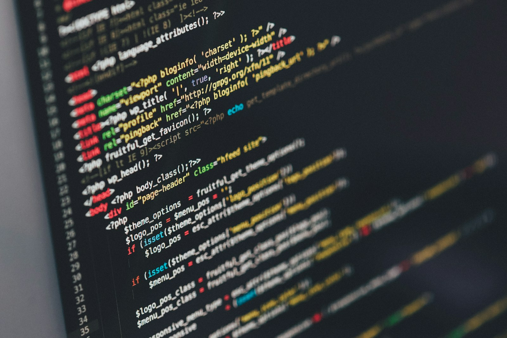

> Read this article in Portuguese: [Como a IA está Redefinindo o Desenvolvimento Moderno de Software](./pt-BR.md)

Writing about AI and development feels strange and exciting at the same time. Until recently I still looked at ChatGPT as a lab curiosity; now it is already in my workflow as if it had always been part of the team. In this first post I want to share what I’ve learned over the past few months using intelligent tools to think, code, and deliver value faster.

## The Turning Point: AI as Copilot
Everything changed when I stopped treating models as “question answerers” and started seeing them as copilots. When I open VS Code, my first command is no longer `npm start`, but “Help me structure this module.” AI suggests sequences of steps, test prototypes, and even reminds me of dependencies I forgot. That drastically reduced the time spent on repetitive tasks and freed up mental space for architecture decisions.

## Where AI Truly Shines
- **Idea exploration**: instead of jumping straight into code, I use AI to simulate approaches and highlight risks. I spot bottlenecks early and avoid rework.
- **Automation of tedious tasks**: generating tests, updating docs, and writing helper scripts are perfect jobs for copilots like Copilot or Cursor.
- **Accelerated learning**: when I meet a new technology, I ask for summaries targeted at the problem I’m trying to solve. That’s far more useful than a generic tutorial.

## Day-to-Day Use Cases
1. **Guided refactoring**: I describe the current state of the module and the desired state. AI suggests an incremental plan, points out fragile parts, and even creates snippets that fit each step.
2. **Preventive reviews**: before opening a PR, I ask for a diff review. I often get suggestions for extra tests or edge cases I would have missed.
3. **Living documentation**: I translate key decisions into quick prompts and receive clear paragraphs, already formatted in Markdown, for the repository.

## Essential Safeguards
No matter how advanced the tools are, I still follow three habits to avoid trouble:
- Confirm the generated code respects internal standards (lint, tests, security).
- Provide rich context in every prompt; AI without context becomes guesswork.
- Record the human reasoning behind decisions. No tool replaces accountability.

## Where We Go From Here
The next frontier isn’t AI coding alone—it’s teams combining human creativity with smart automation. Whoever learns to make that pairing today will be ahead when platforms evolve tomorrow. My recommendation for anyone starting out is simple: pick a side project, set a clear goal, and use AI as a partner from the first brainstorm to the final deploy.

If you’d like to keep this conversation going, reach out on social or drop a comment here. I’m just getting started on this journey—and I can’t wait to see where it takes us.
